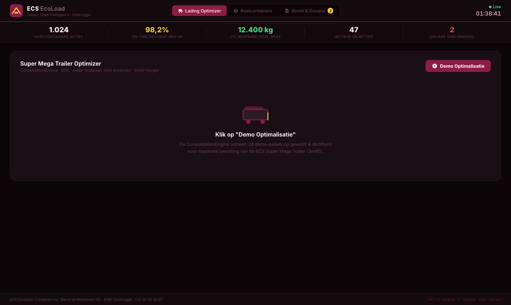
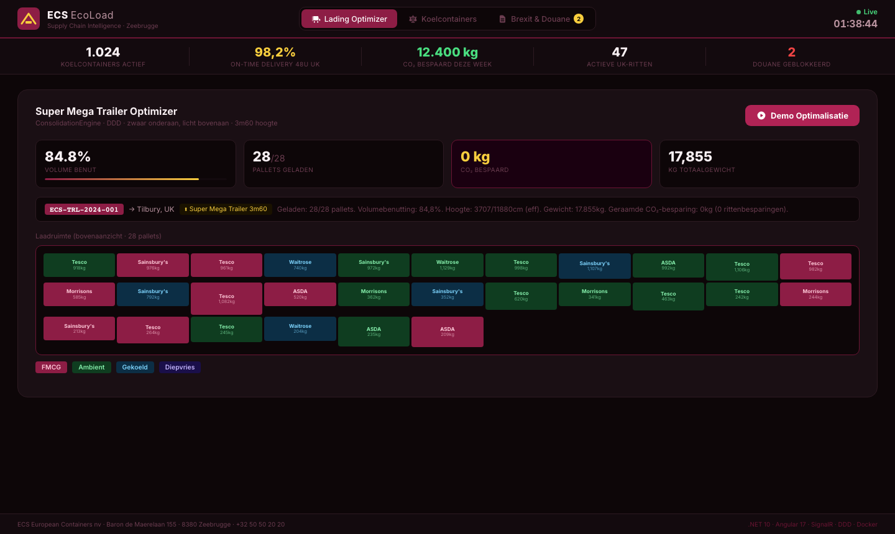
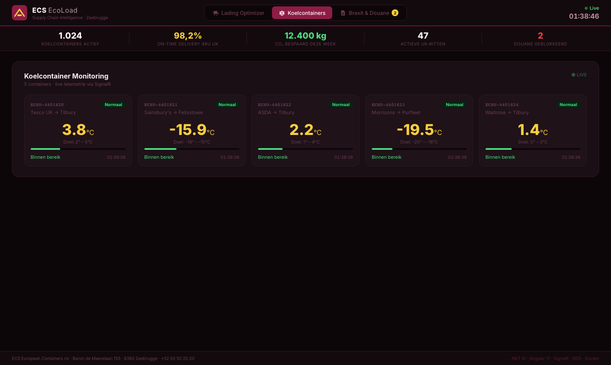
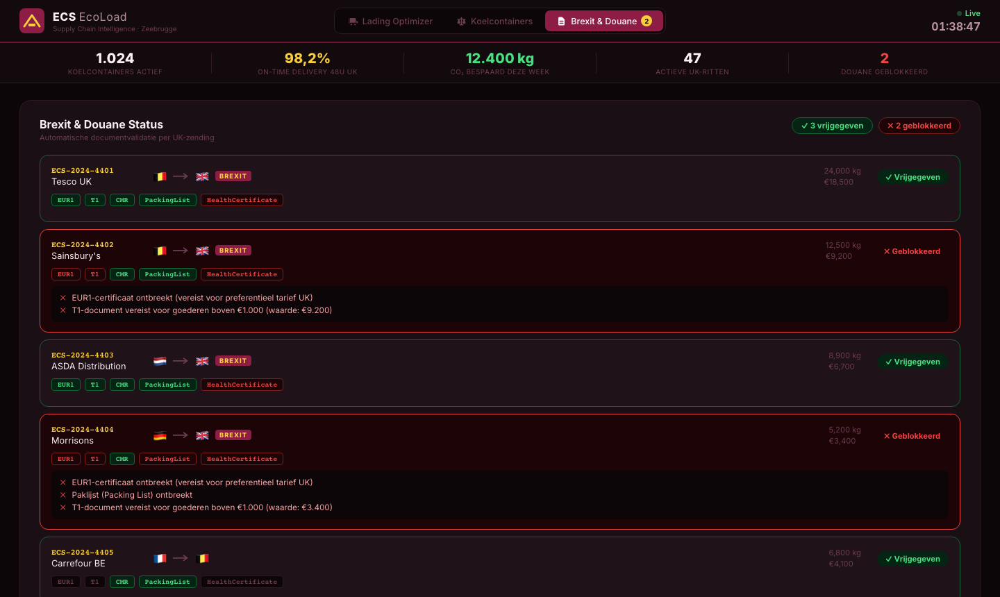

<div align="center">



# ECS EcoLoad & Temp Optimizer

**Portfolio project** — gebouwd als concrete demonstratie van domeinkennis voor de functie<br>
**Software Developer .NET** bij [ECS European Containers](https://www.ecs.be) · Zeebrugge

[](https://dotnet.microsoft.com)
[](https://angular.io)
[](https://dotnet.microsoft.com/apps/aspnet/signalr)
[](https://www.docker.com)
[](backend/tests)
[](backend/src)

</div>

---

## Waarom dit project?

ECS is marktleider in consolidatievervoer naar Britse supermarkten (Tesco, Sainsbury's, ASDA, Morrisons, Waitrose) met een 48u-leveringsgarantie. Hun unique selling point: het slim mengen van zware en lichte goederen in **Super Mega Trailers (3m60 hoog)** — minder ritten, minder CO₂, hogere bezettingsgraad.

Tegelijkertijd beheert ECS **>1.000 koelcontainers** voor temperatuurgevoelige goederen richting het VK. Een afwijking van 2°C kan een volledige supermarktzending onverkoopbaar maken.

Dit project simuleert de interne tooling die een ECS-planner en logistiek operator dagelijks zou gebruiken — en laat zien dat ik de business begrijp, niet alleen de code.

---

## Schermafbeeldingen

### Tab 1 — Super Mega Trailer Optimizer



> De **ConsolidationEngine** sorteert pallets op dichtheid (zwaar/dense onderaan, licht bovenaan) voor maximale benutting van de ECS 3m60 trailer. Visuele loading bay met kleurcodering per cargoType.

### Tab 2 — Live Koelcontainer Monitoring



> **SignalR WebSocket** verbinding voor real-time temperatuurupdates. Kritieke afwijkingen worden binnen seconden als alert getoond aan alle verbonden operators — zonder page refresh.

### Tab 3 — Brexit & Douane Validator



> Automatische **Brexit-documentvalidatie** per UK-zending: EUR1-certificaat, T1, CMR, PackingList. Geblokkeerde zendingen tonen exact welk document ontbreekt, inclusief waarde-drempel voor T1.

---

## Tech Stack

| Laag | Technologie | Relevantie voor ECS |
|------|-------------|---------------------|
| **Backend** | .NET 10 · C# · ASP.NET Core | Hoofdvacature-eis |
| **Architectuur** | Domain-Driven Design · Clean Architecture | Schaalbaar en testbaar |
| **Real-time** | SignalR (WebSockets) | Live temperatuuralerts zonder polling |
| **Frontend** | Angular 17 (Standalone Components) | Hoofdvacature-eis |
| **Tests** | xUnit · FluentAssertions (14 tests) | Kwaliteitsborging |
| **Containerisatie** | Docker · Docker Compose · Nginx | Azure-ready, Kubernetes-klaar |
| **API Docs** | Swagger / OpenAPI | `localhost:5000/swagger` |

---

## Architectuur

```
┌───────────────────────────────────────────────────────┐
│                Angular 17 Dashboard                    │
│  ┌─────────────────┐ ┌──────────────┐ ┌────────────┐  │
│  │ Trailer         │ │ Reefer       │ │ Brexit &   │  │
│  │ Optimizer       │ │ Monitor      │ │ Douane     │  │
│  │ (visuele bay)   │ │ (live gauge) │ │ validator  │  │
│  └────────┬────────┘ └──────┬───────┘ └─────┬──────┘  │
└───────────┼────────────────│─────────────────│─────────┘
            │ HTTP REST       │ SignalR WS      │ HTTP REST
┌───────────▼────────────────▼─────────────────▼─────────┐
│                    .NET 10 Web API                       │
│                                                          │
│  Domain Layer (DDD Aggregates)                          │
│  ┌──────────┐  ┌───────────────┐  ┌──────────────────┐  │
│  │ Trailer  │  │ ReeferContain │  │ Shipment         │  │
│  │ + Pallet │  │ er            │  │ + RunBrexitCheck │  │
│  └──────────┘  └───────────────┘  └──────────────────┘  │
│                                                          │
│  Application Layer                                       │
│  ┌──────────────────────────────────────────────────┐   │
│  │ ConsolidationEngine  │  ReeferSimulator (BG svc) │   │
│  └──────────────────────────────────────────────────┘   │
└──────────────────────────────────────────────────────────┘
                  │ Docker Compose
┌─────────────────▼────────────────────────────────────────┐
│  Infrastructure — Azure-ready / Kubernetes-klaar          │
│  Docker · Nginx reverse proxy · AKS deployment           │
└──────────────────────────────────────────────────────────┘
```

### DDD Aggregates

| Aggregate | Verantwoordelijkheid |
|-----------|----------------------|
| `Trailer` | Max 33 pallets, 360cm hoogte, berekent volumebenutting |
| `Pallet` | Gewicht, hoogte, cargoType, dichtheid (kg/m³) |
| `ReeferContainer` | Huidige vs. doeltemperatuur, genereert afwijkings-events |
| `Shipment` | `RunBrexitCheck()` — valideert documenten per UK-zending |
| `ConsolidationEngine` | Domeinservice: sorteert op dichtheid, berekent CO₂-besparing |

---

## Snel starten

### Vereisten
- [.NET 10 SDK](https://dotnet.microsoft.com/download)
- [Node.js 20+](https://nodejs.org/)
- [Docker Desktop](https://www.docker.com/products/docker-desktop/) *(optioneel)*

### Lokaal — één commando

```bash
git clone https://github.com/KippieG/ecs-ecoload.git
cd ecs-ecoload
bash run.sh
```

| Service | URL |
|---------|-----|
| Dashboard | http://localhost:4200 |
| API | http://localhost:5000 |
| Swagger | http://localhost:5000/swagger |

### Met Docker Compose

```bash
docker-compose up --build
```

### Tests draaien

```bash
cd backend
dotnet test --nologo
# Passed! - Failed: 0, Passed: 14, Skipped: 0
```

---

## API Endpoints

| Method | Route | Beschrijving |
|--------|-------|--------------|
| `POST` | `/api/trailers/demo` | Demo-optimalisatie: 28 pallets, gemixte cargo |
| `POST` | `/api/trailers/optimize` | Eigen palletlijst optimaliseren |
| `GET`  | `/api/reefers` | Alle koelcontainers met live temperatuurstatus |
| `POST` | `/api/reefers/{id}/telemetry` | IoT temperatuurreading doorsturen |
| `GET`  | `/api/customs` | Alle zendingen met Brexit-documentstatus |
| `POST` | `/api/customs/check` | Nieuwe zending valideren |
| `WS`   | `/hubs/reefer` | SignalR WebSocket hub |

---

## Projectstructuur

```
ecs-ecoload/
├── backend/
│   ├── src/ECS.EcoLoad.API/
│   │   ├── Domain/              ← DDD: Pallet, Trailer, ReeferContainer, Shipment
│   │   ├── Services/            ← ConsolidationEngine, ReeferSimulator, Stores
│   │   ├── Controllers/         ← Trailers, Reefers, Customs
│   │   ├── Hubs/                ← ReeferHub (SignalR)
│   │   └── Program.cs
│   └── tests/ECS.EcoLoad.Tests/ ← 14 unit tests (xUnit + FluentAssertions)
├── frontend/
│   └── src/app/
│       ├── dashboard/           ← Hoofd-layout, KPI-balk, tab-navigatie
│       ├── trailer-view/        ← Visuele loading bay + stats
│       ├── reefer-monitor/      ← Live temperatuurkaarten + alerts
│       ├── customs-check/       ← Brexit-documentvalidatie
│       └── shared/              ← Models, ApiService, SignalRService
├── docker-compose.yml
├── run.sh                       ← Één commando voor lokale opstart
└── README.md
```

---

## Architectuurkeuzes

**Waarom DDD en geen simpele CRUD?**
ECS is een 24/7 logistiek bedrijf. Aparte domeinen (lading vs. temperatuur vs. douane) kunnen onafhankelijk schalen en onderhouden worden. Als de reefer-module een hotfix nodig heeft, mag het boekingssysteem daar geen hinder van ondervinden.

**Waarom SignalR en geen polling?**
Temperatuurafwijkingen in koelcontainers moeten binnen seconden bij de operator zijn. Polling elke 5s geeft onnodige serverbelasting; SignalR pusht enkel wanneer er iets verandert.

**Waarom Docker-first?**
De vacature vermeldt Kubernetes en Docker als pluspunten. De applicatie is van dag één containerized zodat deployment naar **Azure Kubernetes Service (AKS)** een minimale stap is.

---

## Roadmap

- [ ] Azure Service Bus integratie (echte EDA tussen microservices)
- [ ] MS SQL Server + Entity Framework Core (nu: in-memory voor demo)
- [ ] Azure Kubernetes Service (AKS) met Helm charts
- [ ] Domain Events: `PalletLoadedEvent`, `TrailerDispatchedEvent` (audit trail)
- [ ] Automatische CO₂-rapportage per week/maand

---

<div align="center">

**Philippe Godfroy** · [philgodf@gmail.com](mailto:philgodf@gmail.com)

*Gebouwd als portfolio project voor de Software Developer vacature bij ECS European Containers, Zeebrugge.*

</div>
