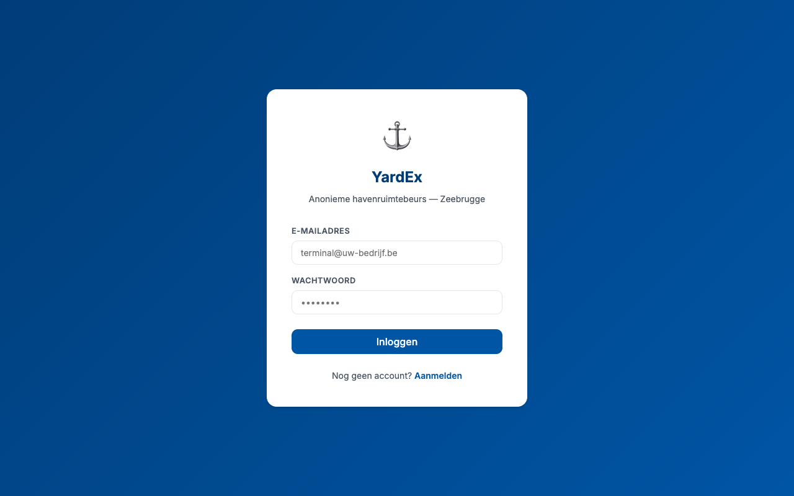
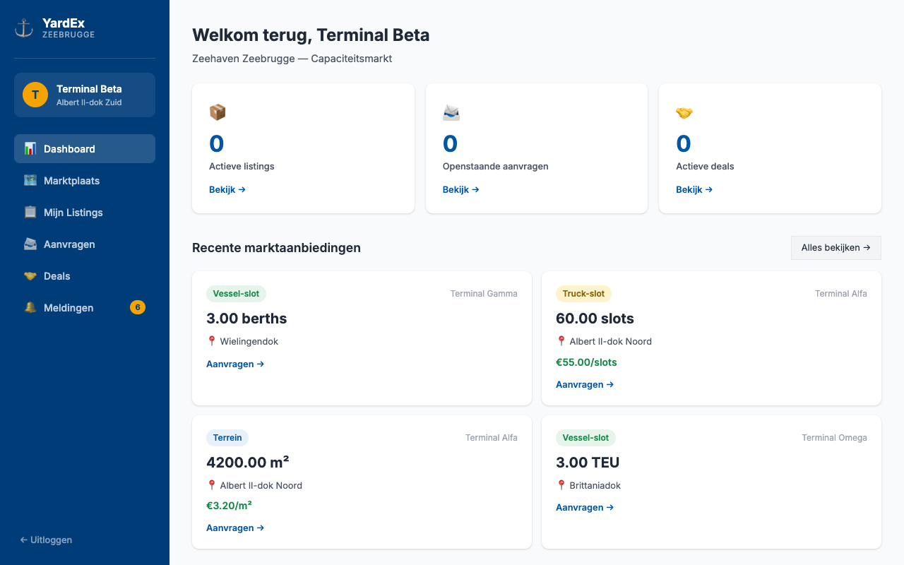
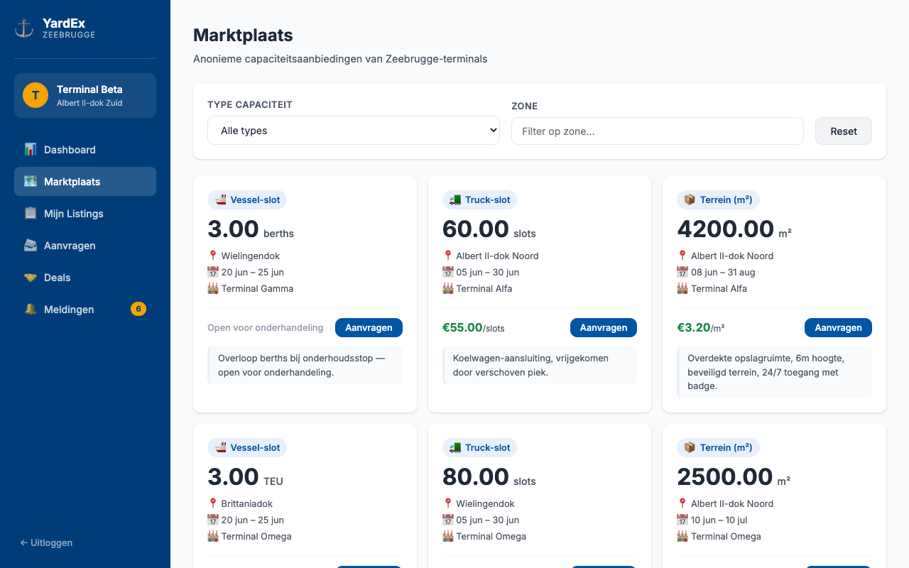
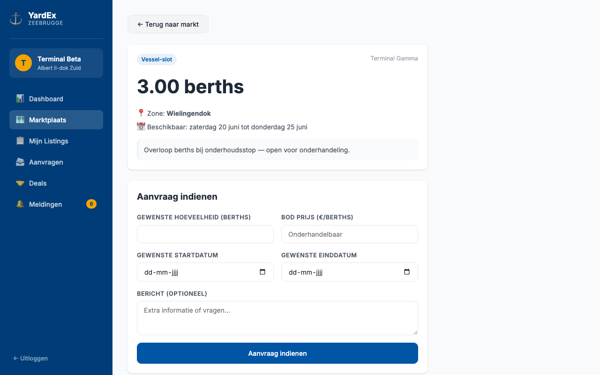
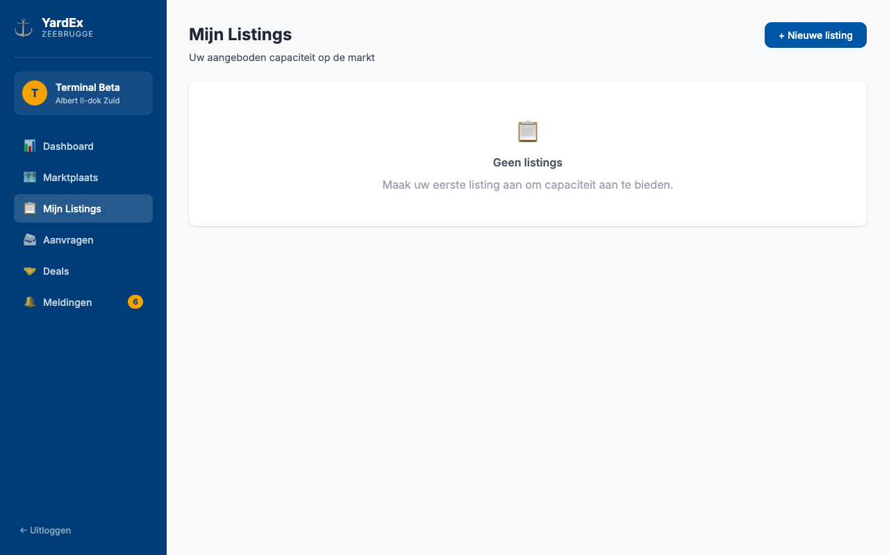
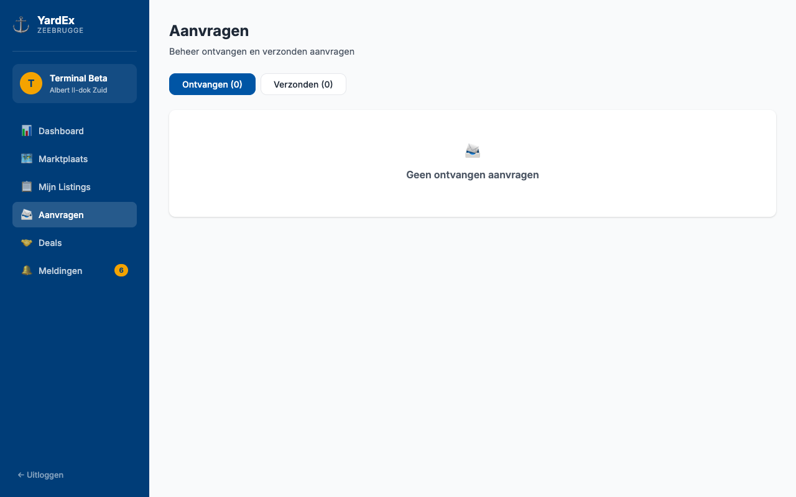

<div align="center">

# ⚓ YardEx
### Anonymous Port Capacity Exchange — Zeebrugge

*Terminals buy and sell surplus yard space, truck slots, and vessel slots without ever revealing their identity.*

[](https://github.com/KippieG/YardEx/actions/workflows/ci.yml)
[](https://nodejs.org/)
[](https://react.dev/)
[](https://www.postgresql.org/)
[](https://www.docker.com/)
[](LICENSE)

</div>

---

## The problem

Port terminals regularly have unused capacity — empty yard space, idle truck gates, or unoccupied vessel berths — while neighbouring terminals are overloaded. Today, deals happen over the phone, through personal contacts, or not at all. There is no neutral, digital place to match supply and demand.

**YardEx is that place.**

---

## Screenshots

<table>
  <tr>
    <td></td>
    <td></td>
  </tr>
  <tr>
    <td align="center"><strong>Login</strong></td>
    <td align="center"><strong>Dashboard</strong></td>
  </tr>
  <tr>
    <td></td>
    <td></td>
  </tr>
  <tr>
    <td align="center"><strong>Marketplace</strong></td>
    <td align="center"><strong>Listing detail & request</strong></td>
  </tr>
  <tr>
    <td></td>
    <td></td>
  </tr>
  <tr>
    <td align="center"><strong>My Listings</strong></td>
    <td align="center"><strong>Requests (accept / reject)</strong></td>
  </tr>
</table>

---

## How it works

```
Terminal A (provider)                 Terminal B (requester)
──────────────────────                ──────────────────────
1. Posts surplus yard space      →    2. Sees anonymous listing on marketplace
   (alias only, no real name)              (provider shown as "Terminal Alfa")

                                     3. Submits a booking request
                                          with quantity + offered price

4. Gets notified anonymously     ←
5. Reviews request, clicks            
   Accept ─────────────────────────── Deal created
                                         ↓
6. Real contact details revealed      Real contact details revealed
   to Terminal B                      to Terminal A
```

---

## Features

| Feature | Description |
|---------|-------------|
| **Anonymous marketplace** | Companies see only aliases — real names and emails are never exposed |
| **3 capacity types** | Yard space (m²), truck slots, vessel slots / berths |
| **Flexible pricing** | Fixed price per unit, or open-to-negotiation |
| **Request flow** | Anonymous booking requests with counter-offer price |
| **One-click deal** | Accept → deal created, all other pending requests auto-rejected |
| **Contact reveal** | Real details unlocked only after a deal is confirmed |
| **In-app notifications** | Real-time badge + feed for new listings, requests, and deal updates |
| **Zone filtering** | Filter by Zeebrugge dock zone (Albert II, Wielingendok, Brittaniadok, …) |
| **Dashboard** | Live overview of active capacity, open requests, and confirmed deals |

---

## Tech stack

| Layer | Technology |
|-------|------------|
| Frontend | React 18, React Router v6, Vite 5 |
| Styling | CSS custom properties (no CSS framework, zero runtime overhead) |
| Backend | Node.js 20, Express 4 |
| Auth | JWT (HS256, 7-day tokens), bcryptjs password hashing |
| Database | PostgreSQL 16, UUID primary keys, `pg` driver |
| Dev tools | Nodemon, Docker Compose |
| CI | GitHub Actions (Node 20 & 22 matrix, Postgres service container) |

---

## Quick start

### Option A — Docker (one command)

```bash
git clone https://github.com/KippieG/YardEx.git && cd YardEx

# Start Postgres
docker-compose up -d

# Apply schema + load demo data
docker exec -i yard-slot-sharer-postgres-1 psql -U postgres yardex < database/migrations/001_init.sql
docker exec -i yard-slot-sharer-postgres-1 psql -U postgres yardex < database/migrations/002_contact_fields.sql
docker exec -i yard-slot-sharer-postgres-1 psql -U postgres yardex < database/seed.sql

# Start server
cd server && cp .env.example .env && npm install && npm run dev &

# Start client (new terminal)
cd client && npm install && npm run dev
```

Open **http://localhost:5173** and log in with a demo account.

### Option B — Existing PostgreSQL

```bash
# 1. Create database and apply schema
createdb yardex
psql yardex < database/migrations/001_init.sql
psql yardex < database/migrations/002_contact_fields.sql
psql yardex < database/seed.sql   # optional demo data

# 2. Configure server
cd server && cp .env.example .env
# Edit .env — set DB credentials and a strong JWT_SECRET

# 3. Start
npm install && npm run dev       # API: http://localhost:3001

# 4. Start client
cd ../client && npm install && npm run dev   # UI: http://localhost:5173
```

---

## Demo accounts

After running `database/seed.sql`:

| Alias | Email | Password |
|-------|-------|----------|
| Terminal Alfa | `alfa@demo.yardex.port` | `Zeebrugge2026!` |
| Terminal Beta | `beta@demo.yardex.port` | `Zeebrugge2026!` |
| Terminal Gamma | `gamma@demo.yardex.port` | `Zeebrugge2026!` |
| Terminal Delta | `delta@demo.yardex.port` | `Zeebrugge2026!` |
| Terminal Epsilon | `epsilon@demo.yardex.port` | `Zeebrugge2026!` |

Log in as **Alfa** to see existing listings. Log in as **Beta** to browse the marketplace and submit a request to Alfa.

---

## Environment variables

All variables live in `server/.env` (copy from `.env.example`):

| Variable | Default | Description |
|----------|---------|-------------|
| `DB_HOST` | `localhost` | PostgreSQL host |
| `DB_PORT` | `5432` | PostgreSQL port |
| `DB_NAME` | `yardex` | Database name |
| `DB_USER` | `postgres` | Database user |
| `DB_PASSWORD` | `postgres` | Database password |
| `JWT_SECRET` | — | **Required.** Use a long random string in production |
| `PORT` | `3001` | API server port |
| `CLIENT_URL` | `http://localhost:5173` | CORS allowed origin |

---

## API reference

All endpoints require `Authorization: Bearer <token>` unless noted.

### Auth

| Method | Endpoint | Description |
|--------|----------|-------------|
| `POST` | `/api/auth/register` | Register a new terminal (body: `email`, `password`, `alias`, `zone`) |
| `POST` | `/api/auth/login` | Login, returns `{ token, company }` |
| `GET` | `/api/auth/me` | Get authenticated company profile |
| `GET` | `/api/health` | Health check — no auth required |

### Listings

| Method | Endpoint | Description |
|--------|----------|-------------|
| `GET` | `/api/listings` | All active listings (anonymised). Query: `type`, `zone`, `from`, `until` |
| `GET` | `/api/listings/my/listings` | Own listings with pending request count |
| `GET` | `/api/listings/:id` | Single listing detail |
| `POST` | `/api/listings` | Create listing |
| `PATCH` | `/api/listings/:id/cancel` | Cancel own active listing |

### Requests

| Method | Endpoint | Description |
|--------|----------|-------------|
| `POST` | `/api/requests` | Submit a booking request on a listing |
| `GET` | `/api/requests/received` | Requests received on own listings |
| `GET` | `/api/requests/sent` | Requests you have sent |
| `POST` | `/api/requests/:id/accept` | Accept a request → creates deal, rejects others |
| `POST` | `/api/requests/:id/reject` | Reject a request |

### Deals

| Method | Endpoint | Description |
|--------|----------|-------------|
| `GET` | `/api/deals` | All deals (as provider or requester) |
| `PATCH` | `/api/deals/:id/complete` | Mark a deal as completed |

### Notifications

| Method | Endpoint | Description |
|--------|----------|-------------|
| `GET` | `/api/notifications` | Last 50 notifications |
| `GET` | `/api/notifications/unread-count` | `{ count: N }` |
| `POST` | `/api/notifications/mark-read` | Body: `{ ids: [...] }` (empty = mark all) |

---

## Database schema

```
companies
  id · alias · email · password_hash · zone · verified
  company_real_name · contact_name · contact_phone · contact_email · vat_number

listings
  id · company_id → companies
  type (yard | slot_truck | slot_vessel)
  capacity · unit · zone
  available_from · available_until
  price_per_unit · currency · description
  status (active | reserved | completed | cancelled)

requests
  id · listing_id → listings · requesting_company_id → companies
  quantity_needed · requested_from · requested_until
  offered_price · message
  status (pending | accepted | rejected | cancelled)

deals
  id · listing_id → listings · request_id → requests
  provider_company_id → companies · requester_company_id → companies
  agreed_quantity · agreed_price · period_from · period_until
  status (confirmed | in_progress | completed | disputed)
  provider_notes · requester_notes

notifications
  id · company_id → companies
  type · title · body · read
  related_listing_id → listings · related_request_id → requests
```

---

## Privacy model

The anonymity guarantee is enforced at the API layer:

- `company_id` is **never** returned in listing or request responses.
- Other terminals see only the `alias` field (e.g. *"Terminal Alfa"*).
- Real contact details (`company_real_name`, `contact_email`, etc.) are stored in separate columns and are **only** exposed after a deal reaches `confirmed` status — a feature on the roadmap.
- JWTs contain `id`, `alias`, and `zone` only.

---

## Business model

| Stream | Details |
|--------|---------|
| **Transaction fee** | 2–4% of the deal value per confirmed match |
| **Analytics subscription** | Monthly per-terminal fee for usage dashboards |
| **TOS integration** | Premium tier — real-time slot availability via Navis N4 / CargoWise API |

---

## Roadmap

- [ ] Email notifications on new matches and deal confirmations (SendGrid)
- [ ] Date-range filter in the marketplace
- [ ] AI price suggester based on historical port utilisation data
- [ ] TOS integration — Navis N4 API for live slot availability
- [ ] Stripe payment processing with escrow
- [ ] Post-deal contact reveal flow in the UI
- [ ] Multi-port expansion: Antwerp (PSA, DP World), Ghent
- [ ] Mobile app (React Native)

---

## Contributing

See [CONTRIBUTING.md](CONTRIBUTING.md) for the full guide — setup, code conventions, migration workflow, and PR checklist.

## Security

See [SECURITY.md](SECURITY.md) for the vulnerability reporting process and a description of security practices in the codebase.

## License

MIT © Philippe Godfroy — see [LICENSE](LICENSE).

---

<div align="center">
  <sub>Built for the port logistics sector — Zeehaven Zeebrugge, Belgium.</sub>
</div>
