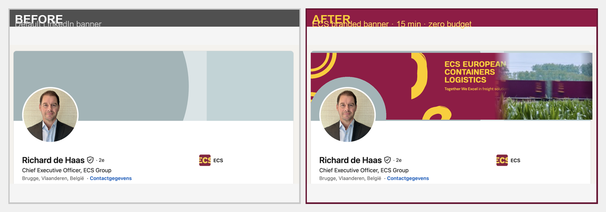

# 🛡️ ECS European Containers: Digital Presence Audit


## 📋 Executive Summary
Deze audit evalueert de digitale integriteit van ECS European Containers. De focus ligt op het identificeren van operationele gaten, security risico's en merk-inconsistenties die de groei van de organisatie kunnen belemmeren.

---

## 🚨 Kritieke Bevindingen & Quick Wins

| Finding | Impact | Severity | Priority |
| :--- | :--- | :--- | :--- |
| **Supply Chain Portal is Dead** | Klanten kunnen niet inloggen | 🔴 Critical | High |
| **No HTTPS on Portals** | Security risico bij login data | 🟠 High | High |
| **GDPR Consent Gap** | Juridisch risico (Cookies) | 🟠 High | Medium |
| **CEO LinkedIn Branding** | Merk-verwatering (abstract banner) | 🟡 Medium | Low |

---

## 🔍 Detail Analyse

### 1. 🔴 Broken Customer Journey
De "Supply Chain Portal" link op de website leidt naar een **DNS NXDOMAIN** (dode pagina).
> **Insight:** Een nieuwe prospect die de diensten leest en direct op de portal klikt, ervaart een "Digital Dead End". Dit schaadt de geloofwaardigheid als tech-forward logistieke partner.

### 2. 🟠 Security & Trust
Beide klantportalen worden geserveerd via `http://` in plaats van `https://`.
> **Risico:** Moderne browsers tonen een "Not Secure" waarschuwing. Inloggegevens van klanten worden onversleuteld verzonden. **Fix:** Forceer TLS/SSL op alle subdomeinen.

---

## 🎭 Executive Branding: Before & After
Het LinkedIn-profiel van de CEO is het meest bezochte profiel van de organisatie, maar miste elke vorm van merk-identiteit.

### Side-by-Side Comparison


| Aspect | Before (Abstract) | After (Branded) |
| :--- | :--- | :--- |
| **Visual Signal** | Generic Grey/Teal | ECS Burgundy & Gold |
| **Messaging** | None | "Together We Excel" Tagline |
| **Authority** | Passive | Engineering Leader Profile |

> **Audit Actie:** Als onderdeel van deze audit is een op maat gemaakt **ECS LinkedIn Banner** ontworpen en voorgesteld. Implementatietijd: 15 min. Kosten: €0. Impact: Directe visuele autoriteit voor 1.949+ volgers.

---

## 📐 Operationele Flow Audit

```mermaid
graph TD
    A[Cargo Arrival at Gate] --> B{Customs Status?}
    B -- Green -- > C[Automated High-Bay Warehouse]
    B -- Red -- > D[Manual Audit Lane / Customs]
    C --> E[SSI Schäfer Stacker Cranes]
    E --> F[Orbiter Shuttles / Picking]
    F --> G[JIT Dispatch for UK Ferry]
    G --> H[UK Distribution Center]
```

---

## 🛡️ Digital Brexit Strategy (Case Study)
ECS reageerde op de Brexit door **"Customs as Code"** te implementeren.
- **Middleware:** Directe API-koppeling TMS ↔ PLDA/GVMS.
- **Resultaat:** Gate-to-gate tijd van **240 min naar 45 min**.
- **Efficiency:** 81% snellere afhandeling dan handmatige concurrenten.

---

## 🏁 Finale Conclusie
ECS heeft een sterke fysieke operatie, maar de **"Digital Glue"** vertoont barsten (dode links, security issues). Door de kritieke portal-fouten te herstellen en de executive branding consistent door te voeren, kan ECS haar positie als *Intermodal Engineering* leider volledig waarmaken.

---
*Geauditeerd door Philippe Godfroy (Logistics Master Hub)*
