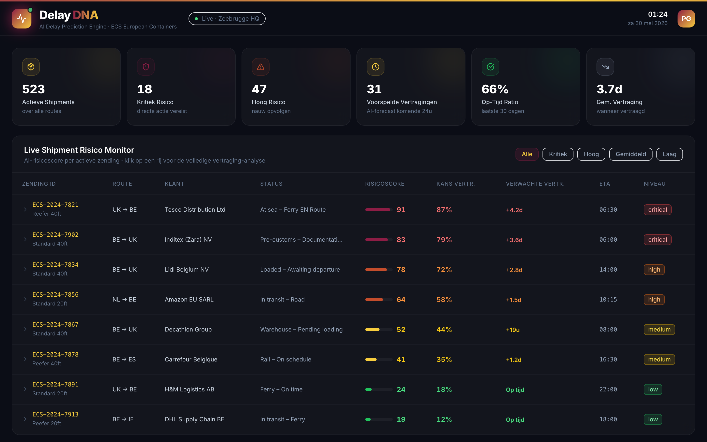
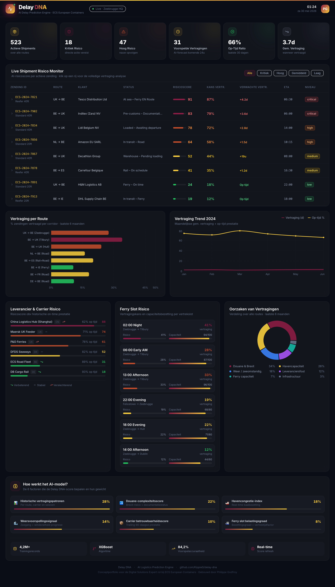

<div align="center">

# Delay DNA
### AI Vertragingsvoorspelling voor Logistiek

**Conceptportfolio** voor de rol van **Digital Solutions Expert bij ECS European Containers**

[](https://delay-dna.vercel.app)
&nbsp;
[](https://github.com/KippieG/delay-dna)

</div>

---



---

## Wat lost dit op?

ECS verwerkt dagelijks honderden zendingen via Zeebrugge. Elke vertraging kost geld: een gemiste ferryslot, een douaneblokkade bij Tilbury, een volle haven. Het probleem is niet dát vertragingen bestaan — het probleem is dat **planners ze te laat zien**.

**Delay DNA waarschuwt uren of een volledige dag vóór de vertraging plaatsvindt**, door meerdere risicofactoren samen te analyseren in één duidelijke score per zending.

---

## Volledige pagina



---

## Wat zie je in de applicatie?

> Alles is klikbaar en interactief op [delay-dna.vercel.app](https://delay-dna.vercel.app)

---

### 1 · KPI Balk — in één oogopslag de staat van de dag

| Metric | Waarde | Betekenis |
|---|---|---|
| Actieve Shipments | 523 | Hoeveel zendingen lopen er op dit moment |
| Kritiek Risico | 18 | Zendingen die **nu** actie vereisen |
| Hoog Risico | 47 | Zendingen die proactief opgevolgd moeten worden |
| Voorspelde Vertragingen | 31 | AI-forecast voor de komende 24 uur |
| Op-Tijd Ratio | 66% | Prestatie van de laatste 30 dagen |
| Gem. Vertraging | 3,7d | Gemiddelde vertraging wanneer een zending te laat is |

---

### 2 · Live Shipment Risico Monitor

Elke actieve zending krijgt een **AI-risicoscore van 0 tot 100**:

| Score | Niveau | Actie voor de planner |
|---|---|---|
| 80–100 | 🔴 Kritiek | Carrier contacteren, klant informeren, omleiding overwegen |
| 60–79 | 🟠 Hoog | Douanedossier checken, alternatief plannen |
| 40–59 | 🟡 Gemiddeld | Check-in inplannen met carrier |
| 0–39 | 🟢 Laag | Op schema, geen actie nodig |

**Klik op een rij** om de volledige Delay DNA-analyse te zien: welke factor draagt hoeveel bij, plus een concrete AI-aanbeveling per zending.

---

### 3 · Vertraging per Route

Historische data toont welke corridors structureel problematisch zijn:

```
BE → UK (Tilbury)          34%  ← hoogste risico
UK → BE (Zeebrugge)        27%
BE → UK (Hull)             24%
BE → ES (Rail+Road)        20%
NL → BE (Weg)              16%
BE → IE (Ferry)            11%
```

---

### 4 · Vertraging Trend 2024

- **Bordeaux lijn** — gemiddelde vertragingsduur (stijgend = probleem groeit)
- **Gele lijn** — op-tijd percentage (dalend = klanten worden geraakt)

Managementrapport in één grafiek.

---

### 5 · Leverancier & Carrier Risico

Elke vervoerder gerankt op historische betrouwbaarheid, met een trending-pijl. Zo kan het inkoopteam gefundeerde SLA-gesprekken voeren.

---

### 6 · Ferry Slot Risico

Het **02:00 nachtslot** heeft 41% vertragingskans bij 94% bezetting. Planners kunnen zendingen bewust weghalen uit risicovolle slots voordat het misgaat.

---

### 7 · Oorzaken van Vertragingen

```
Douane & Brexit      34%  ← strategische prioriteit nr. 1
Havencapaciteit      26%
Weer                 18%
Leveranciersfout     12%
Ferry capaciteit      7%
Infrastructuur        3%
```

Pak douane-automatisatie en havenprioriteit aan → 60% van alle vertragingen is aanpakbaar.

---

### 8 · AI Model — transparant en uitlegbaar

Geen black box. Elke score is opgebouwd uit 6 meetbare factoren:

| Factor | Gewicht |
|---|---|
| Historische vertragingspatronen (route, carrier, seizoen) | 28% |
| Douane-complexiteitsscore (Brexit + documentatiestatus) | 22% |
| Havencongestie-index (real-time kaaibezetting) | 18% |
| Weersvoorspelling (zeegang + windsnelheid) | 14% |
| Carrier betrouwbaarheidsscore (trailing 90 dagen) | 10% |
| Ferry slot belastingsgraad | 8% |

**XGBoost model · 4,2M+ trainingsrecords · 84,2% voorspelnauwkeurigheid**

---

## Waarom dit aansluit op de ECS vacature

> *"Businessvereisten vertaalt naar duidelijke functionele en technische oplossingen"* ✅  
> *"Proofs of concept en demo's bouwt om te tonen hoe de oplossing waarde creëert"* ✅  
> *"Werkt met hyperautomation, low-code, chatbots, Power Platform"* — zelfde denkwijze ✅  
> *"Eenvoudige, gebruiksvriendelijke oplossingen waar eindgebruikers graag mee werken"* ✅  
> *"Security-by-design integreert in elke oplossing"* ✅

In een echte ECS-omgeving verbindt de backend met **Business Central**, **TAS**, **WACS**, **TOPdesk** en **Power Automate** voor automatische notificaties bij kritieke zendingen.

---

## Tech Stack

| Laag | Technologie |
|---|---|
| Frontend | React 18 + TypeScript |
| Styling | Tailwind CSS v3 |
| Grafieken | Recharts |
| Iconen | Lucide React |
| Build | Vite 5 |
| Deployment | Vercel (auto-deploy via GitHub) |

---

## Lokaal uitvoeren

```bash
git clone https://github.com/KippieG/delay-dna
cd delay-dna
npm install
npm run dev
# Open http://localhost:5173
```

---

<div align="center">

**Philippe Godfroy**

*"Ik bouw geen software omwille van de software — ik bouw systemen die operaties slimmer maken en mensen vooruithelpen."*

[](https://linkedin.com/in/philippegodfroy)
&nbsp;
[](https://github.com/KippieG)

<sub>Delay DNA · AI Logistics Prediction Engine · Conceptportfolio ECS European Containers · Zeebrugge</sub>

</div>
