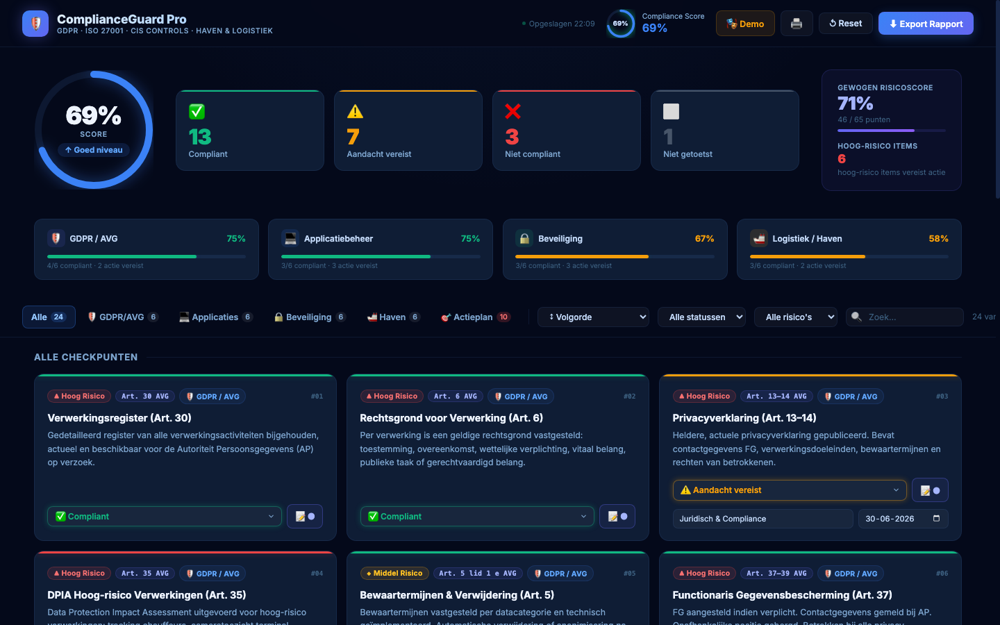
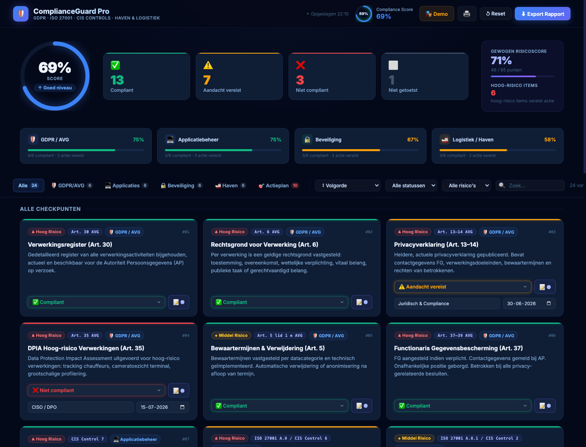
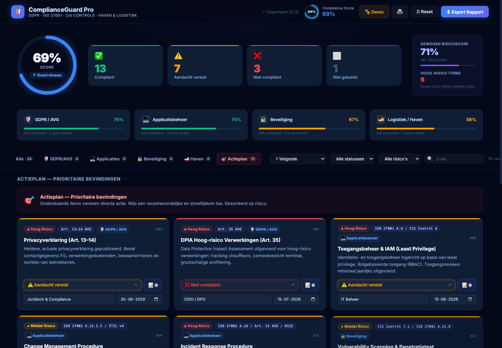
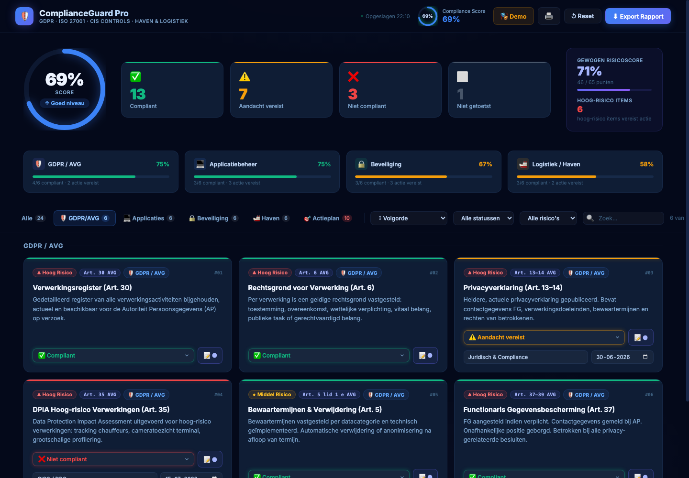

<div align="center">

# 🛡️ ComplianceGuard Pro

### GDPR & Compliance Checker voor Logistiek & Haven

*Een interactief auditinstrument met 24 checkpunten, live risicoscoring, actieplan-tracking en HTML-export.*

[](https://github.com/KippieG/gdpr-compliance-checker)
[](LICENSE)
[]()
[](#snel-starten)
[]()
[]()

</div>

---

## Overzicht

**ComplianceGuard Pro** is een browser-gebaseerde compliance checker gebouwd voor logistieke bedrijven, havenbedrijven en supply chain organisaties. Het tool helpt IT- en compliance teams om de stand van zaken in kaart te brengen op vier kritieke domeinen: GDPR/AVG, applicatiebeheer, informatiebeveiliging en sectorspecifieke havenregelgeving.

> **Waarom logistiek?** Havenbedrijven combineren OT/IT-omgevingen (TOS, EDI, SCADA, AEO), verwerken persoonsgegevens van duizenden chauffeurs en klanten, en opereren onder meerdere wettelijke kaders tegelijkertijd (AVG, NIS2, ISPS, douanewetgeving). Standaard compliance checklists missen deze context volledig.

---

## Screenshots

### Dashboard — Live scoring met gewogen risicoscore



*Animated compliance ring, categorie-progressbars, gewogen risicoscore (Hoog ×3 · Middel ×2 · Laag ×1) en realtime statistieken.*

---

### Checkpunten — Alle 24 items met status, risico en notities



*Elke kaart toont de wettelijke referentie, risiconiveau, statusdropdown en een uitstelbaar notitieveld. Bij aandacht/niet-OK verschijnen automatisch velden voor verantwoordelijke en streefdatum.*

---

### Actieplan — Geprioriteerde bevindingen met owner & deadline



*De Actieplan-tab filtert automatisch alle items die actie vereisen, gesorteerd op ernst en risico. Inclusief verantwoordelijke, streefdatum en urgentie-markering (rood = verlopen, oranje = binnen 7 dagen).*

---

### GDPR/AVG — Gefilterde categorieweergave



*Navigeer per wettelijk domein. Elke tab toont hoeveel items actie vereisen en de categorie-compliance score.*

---

## Functies

| Functie | Beschrijving |
|--------|-------------|
| **24 checkpunten** | Verdeeld over 4 domeinen, elk met juridische referentie |
| **Live compliance score** | Animated ring updaten bij elke klik |
| **Gewogen risicoscore** | Hoog ×3 · Middel ×2 · Laag ×1 — geeft echte prioritering |
| **Actieplan tab** | Filtert automatisch attention + non-compliant items, gesorteerd op ernst |
| **Owner + streefdatum** | Per actie-item toewijsbaar; verlopen datums rood gemarkeerd |
| **Notities per item** | Bevindingen, bewijslast of actiepunten vastleggen |
| **Sort & filter** | Op categorie, status, risico, sort op ernst of volgorde |
| **Demo-modus** | Één klik laadt realistische voorbeelddata (`?demo=1` of knop) |
| **HTML-export** | Volledig opgemaakt auditrapport incl. actieplan-sectie downloaden |
| **Afdrukken** | Print-stijlen ingebakken, geen header/footer zichtbaar |
| **Local Storage** | Voortgang automatisch bewaard tussen sessies |
| **Geen dependencies** | Eén HTML-bestand, werkt offline, geen build-stap |

---

## Snel starten

```bash
# Clone
git clone https://github.com/KippieG/gdpr-compliance-checker.git
cd gdpr-compliance-checker

# Open direct in browser — geen server nodig
open index.html

# Of laad meteen met demo data
open "index.html?demo=1"
```

**Of open online:**
```
https://KippieG.github.io/gdpr-compliance-checker/?demo=1
```

---

## De 24 checkpunten

### 🛡️ GDPR / AVG

| # | Checkpunt | Referentie | Risico |
|---|-----------|-----------|--------|
| 01 | Verwerkingsregister bijgehouden | Art. 30 AVG | 🔴 Hoog |
| 02 | Rechtsgrond voor verwerking vastgesteld | Art. 6 AVG | 🔴 Hoog |
| 03 | Privacyverklaring gepubliceerd en actueel | Art. 13–14 AVG | 🔴 Hoog |
| 04 | DPIA uitgevoerd voor hoog-risico verwerkingen | Art. 35 AVG | 🔴 Hoog |
| 05 | Bewaartermijnen vastgesteld en geïmplementeerd | Art. 5 lid 1e AVG | 🟡 Middel |
| 06 | Functionaris Gegevensbescherming aangesteld | Art. 37–39 AVG | 🔴 Hoog |

### 💻 Applicatiebeheer

| # | Checkpunt | Referentie | Risico |
|---|-----------|-----------|--------|
| 07 | Patchmanagement & updates (kritiek: 48u) | CIS Control 7 | 🔴 Hoog |
| 08 | Toegangsbeheer & IAM — least privilege | ISO 27001 A.9 | 🔴 Hoog |
| 09 | Software Asset Management & licenties | ISO 27001 A.8.1 | 🟡 Middel |
| 10 | Change management procedure (ITIL v4) | ISO 27001 A.12.1.2 | 🟡 Middel |
| 11 | Business Continuity & Disaster Recovery | ISO 27001 A.17 | 🔴 Hoog |
| 12 | Incident Response Procedure (NIS2/AVG) | ISO 27001 A.16 / Art. 33 AVG | 🔴 Hoog |

### 🔒 Beveiliging

| # | Checkpunt | Referentie | Risico |
|---|-----------|-----------|--------|
| 13 | Multi-factor Authenticatie (MFA) | CIS Control 6.3 / NIS2 | 🔴 Hoog |
| 14 | Encryptie data at rest (AES-256) | ISO 27001 A.10.1 | 🔴 Hoog |
| 15 | Encryptie data in transit (TLS 1.2+) | CIS Control 14.4 | 🔴 Hoog |
| 16 | Vulnerability scanning & penetratietest | CIS Control 7.1 | 🟡 Middel |
| 17 | Firewall & OT/IT netwerksegmentatie | CIS Control 12 | 🔴 Hoog |
| 18 | Security awareness training | CIS Control 17 | 🟡 Middel |

### 🚢 Logistiek / Haven

| # | Checkpunt | Referentie | Risico |
|---|-----------|-----------|--------|
| 19 | AEO-certificering & douanedocumentatie | DWU Art. 38–41 | 🔴 Hoog |
| 20 | EDI-verbindingen beveiligd (AS2/SFTP/mTLS) | ISO 27001 A.13.1 | 🔴 Hoog |
| 21 | TOS toegangsbeheer & logging (2 jaar NIS2) | ISO 27001 A.9.2 | 🔴 Hoog |
| 22 | GPS/tracking data GDPR-conform | Art. 6 AVG / WP29 | 🟡 Middel |
| 23 | Verwerkersovereenkomsten carriers (DPA) | Art. 28 AVG | 🔴 Hoog |
| 24 | ISPS Code & havenbeveiliging (PFSP) | SOLAS XI-2 / ISPS 2004 | 🟡 Middel |

---

## Gewogen risicoscoring

De tool berekent twee scores:

| Score | Methode | Doel |
|-------|---------|------|
| **Compliance %** | `(compliant + attention×0.5) / 24 × 100` | Algemeen beeld |
| **Gewogen risico %** | `Σ(status × risicogewicht) / 65 × 100` | Prioritering hoog-risico items |

Risicogewichten: Hoog = 3, Middel = 2, Laag = 1 (max = 65 punten)

> Items met hoog risico wegen zwaarder mee. Een tool met 80% compliant maar 5 niet-OK hoog-risico items scoort lager dan één met 70% compliant maar enkel middel-risico aandachtspunten.

---

## Export — HTML Auditrapport

De exportknop genereert een volledig opgemaakt HTML-rapport met:

- Compliance score + gewogen risicoscore in de header
- Visuele categorie-breakdown per domein
- **Actieplan-sectie** — alleen aandacht/niet-OK items, gesorteerd op ernst
- Volledige tabel met alle 24 bevindingen, verantwoordelijken en streefdata
- Printklaar, geen externe afhankelijkheden

---

## Technische details

```
gdpr-compliance-checker/
├── index.html          ← Volledige applicatie (single-file, ~1400 regels)
├── screenshots/        ← Demo screenshots voor README
│   ├── 01-dashboard.png
│   ├── 02-cards.png
│   ├── 03-actieplan.png
│   └── 04-gdpr.png
└── README.md
```

**Tech stack:**
- Pure HTML5 / CSS3 / Vanilla JavaScript ES6+
- CSS Custom Properties, Grid, Flexbox, Animations
- Web Storage API (localStorage) voor persistentie
- Blob API voor HTML-export
- Google Fonts (Inter) — laadt van CDN, werkt ook offline via system fonts

---

## Wettelijke kaders

| Kader | Volledige naam |
|-------|---------------|
| **AVG / GDPR** | Verordening (EU) 2016/679 — Algemene Verordening Gegevensbescherming |
| **CIS Controls v8** | Center for Internet Security — Critical Security Controls |
| **ISO 27001:2022** | Information Security Management Systems |
| **NIS2** | Richtlijn (EU) 2022/2555 — Beveiliging netwerk- en informatiesystemen |
| **DWU** | Verordening (EU) 2016/952 — Douanewetboek van de Unie |
| **ISPS Code** | International Ship and Port Facility Security Code (SOLAS XI-2) |
| **WP29** | Article 29 Working Party — Richtlijnen tracking & profilering |

---

## Portfolio context

Dit project demonstreert kennis relevant voor een **Functioneel Applicatiebeheerder** rol in een logistieke of enterprise IT-omgeving:

- **GDPR/AVG** — wetsartikelen, FG-rol, DPIA, bewaartermijnen, verwerkersovereenkomsten
- **Enterprise IT beheer** — IAM/RBAC, patchmanagement, ITIL change management, BCP/DR
- **Informatiebeveiliging** — CIS Controls, ISO 27001, MFA, encryptie, netwerksegmentatie, NIS2
- **Logistieke sector** — AEO-certificering, EDI/Portbase, TOS-beheer, ISPS, douanewetgeving
- **Frontend development** — Responsive UI, CSS animations, Vanilla JS state management, Blob export

---

## Disclaimer

Dit tool is een **indicatief hulpmiddel** voor interne audits en zelfevaluatie. Het vervangt geen formele DPIA, juridisch advies of officiële compliance-audit. Raadpleeg een gekwalificeerde privacy- of beveiligingsadviseur voor definitieve beoordelingen.

---

<div align="center">

**Ontwikkeld door Philippe Godfroy**

[](mailto:philgodf@gmail.com)
[](https://github.com/KippieG)

*MIT License · Versie 2.0 · 2026*

</div>
