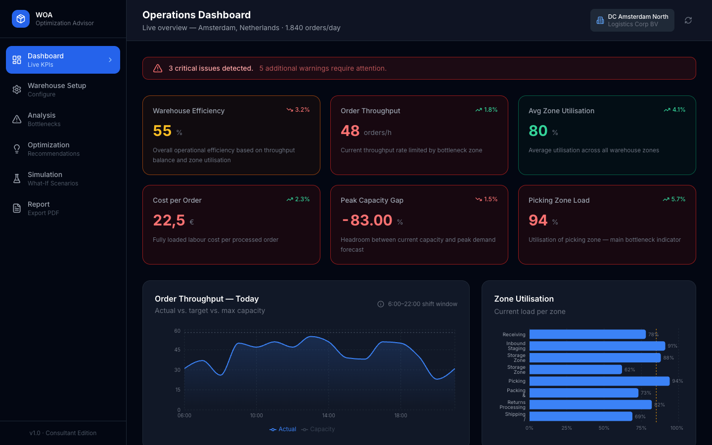

# Warehouse Optimization Advisor (WOA)

> A professional consultant-grade tool for analysing, optimising, and reporting on warehouse operations. Built for logistics consultants who visit client sites, identify inefficiencies, and deliver actionable improvement plans.

**[Live Demo →](https://warehouse-optimization-advisor.vercel.app)**




---

## What It Does

WOA is a decision-support dashboard used during client warehouse visits. You configure the warehouse layout, enter operational data, and the tool instantly:

- **Detects bottlenecks** across all zones using rule-based algorithms
- **Scores efficiency** using throughput balance and zone utilisation models
- **Generates prioritised recommendations** with ROI estimates
- **Simulates what-if scenarios** (peak demand, layout changes, automation, extra staff)
- **Exports a consultant-grade PDF report** with findings and roadmap

---

## Features

| Module | Description |
|---|---|
| **Dashboard** | Live KPI overview, throughput chart, warehouse heatmap, active issue feed |
| **Warehouse Setup** | Configure zones, staff headcount, operational parameters |
| **Bottleneck Analysis** | Severity-ranked issues with business impact assessment, radar chart, travel distance analysis |
| **Optimization** | 8+ rule-based recommendations with impact scores, effort ratings, and payback estimates |
| **Simulation** | 6 preset scenarios (peak demand, fast-mover relocation, automation, cross-docking…) with before/after comparison table and charts |
| **Report** | Full consultant report with executive summary, zone table, recommendations roadmap, and print-to-PDF export |

---

## Bottleneck Detection Engine

The analysis engine evaluates each zone across 5 dimensions:

1. **Zone utilisation** — flags zones ≥ 85% (warning) or ≥ 92% (critical)
2. **Throughput mismatch** — detects rate imbalances between sequential zones (e.g. picking < packing capacity)
3. **Travel distance** — highlights zones where avg picker travel exceeds the 35m optimal threshold
4. **Peak capacity gap** — calculates whether current max throughput meets peak demand (order_volume × peak_multiplier)
5. **Fast-mover SKU positioning** — detects Pareto inefficiency where high-volume SKUs are stored far from picking

---

## Simulation Scenarios

| Scenario | What It Models |
|---|---|
| Peak Season (+40% Volume) | Q4 demand surge vs. current staffing |
| Fast-Mover Relocation | Move top 20% velocity SKUs to golden zone |
| Workforce Expansion (+30%) | Add pickers and packers |
| Cross-Docking Strategy | Bypass storage for 30% of volume |
| Partial Automation (Conveyor) | Conveyor between picking and packing (+35% rate) |
| Split Picking Zones (A/B) | Dedicated fast/slow-mover picking zones |

---

## Tech Stack

- **React 18** + **TypeScript** — component architecture
- **Zustand** — persistent state management (localStorage)
- **Recharts** — all charts (area, bar, radar, radial)
- **Tailwind CSS** — utility-first styling with dark theme
- **Framer Motion** — transitions
- **React Router v6** — client-side routing
- **Vite** — build tooling

---

## Getting Started

```bash
git clone https://github.com/YOUR_USERNAME/warehouse-optimization-advisor.git
cd warehouse-optimization-advisor
npm install
npm run dev
```

Open [http://localhost:5173](http://localhost:5173)

---

## Real-World Use Case

> This tool was designed to support logistics consultants during client site visits. Instead of manually building spreadsheets after each visit, a consultant can input warehouse parameters on-site, immediately see bottlenecks, run scenarios live during the client meeting, and export a branded PDF report at the end of the session.

It mirrors real WMS consulting workflows:

- Inbound receiving → staging → storage slotting → pick routing → pack → ship
- ABC/XYZ velocity analysis for slotting recommendations
- Staff allocation modelling per shift and zone
- Peak demand planning (×2–3 multipliers for B2C fulfilment)

---

## Project Structure

```
src/
├── engine/            # Core algorithms (bottleneck detection, simulation, recommendations)
│   ├── bottleneck.ts  # Rule-based bottleneck detection
│   ├── calculations.ts# KPI calculations, throughput, efficiency scores
│   ├── recommendations.ts # Recommendation engine with impact estimates
│   └── simulation.ts  # What-if scenario runner
├── store/             # Zustand state management
├── types/             # TypeScript interfaces
├── data/              # Sample warehouse dataset
├── components/        # Reusable UI components
│   ├── layout/        # Sidebar, Header, MainLayout
│   └── shared/        # WarehouseMap, StatCard, SeverityBadge
└── pages/             # One file per route
```

---

## License

MIT
